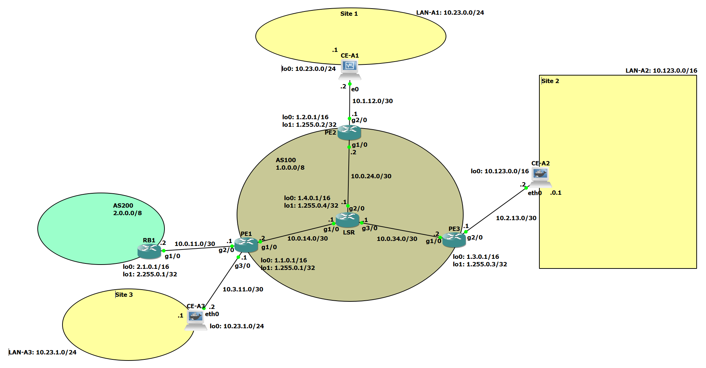

# Progetto-NSD
### Progetto per il corso di Network and System Defence dell'Università di Roma Tor Vergata
__Autori__
* :man_technologist: Adrian Baba 
* :woman_technologist: Sara Da Canal
* :man_technologist: Matteo Fanfa


Lo scopo di questo progetto è simulare la seguente rete: 

Nella rete abbiamo due AS, con AS200 customer di AS100. L'AS100 connette i tre siti di vpnA. Il sito 1 è costituito da due Host e un Client Edge, che comunicano tra di loro tramite MacSec. Il Client Edge presenta un firewall.

## AS100
### Configurazione dei router
I router implementano BGP come protocollo per la comunicazione con il resto della rete, OSPF per la comunicazione interna, MPLS con LDP che fornisce la base per l'instradamento tra diversi siti della VPN.
Abbiamo due tipi di router, LSR, nella parte centrale dell'AS, e Provider Edges. 
#### LSR
La configurazione dell'LSR è la seguente:   
*[SetupLSR.cfg](./scripts/routers/lsr/SetupLSR.cfg "SetupLSR.cfg")*
* Interfaccia di loopback usata per identificare il router:
    ```
    interface Loopback0                     
    ip address 1.255.0.4 255.255.255.255
    ```
* 3 interfacce verso i router PE (riportiamo solo la configurazione verso PE1), con l'attivazione del protocollo MPLS:
    ```
    interface GigabitEthernet1/0
    mpls ip     
    ip address 192.168.14.1 255.255.255.252
    no shutdown
    ```
* Configurazione di OSPF impostando i tre PE come neighbours:
    ```
    router ospf 1
    router-id 1.255.0.4
    network 1.255.0.4 0.0.0.0 area 0
    network 192.168.14.0 0.0.0.3 area 0
    network 192.168.24.0 0.0.0.3 area 0
    network 192.168.34.0 0.0.0.3 area 0
    ```
* Attivazione di LDP per automatizzare l'assegnazione delle label MPLS:
    ```
    mpls ldp autoconfig
    ```
* Route per scartare pacchetti con IP pubblico e sorgente l'AS stesso
    ```
    ip route 1.0.0.0 255.0.0.0 Null0
    ```
#### PE
I tre router PE hanno configurazioni molto simili tra loro, quindi ne verrà analizzata soltanto una (PE2):  
*[SetupPE1.cfg](./scripts/routers/provider-edges/SetupPE1.cfg "SetupPE1.cfg")*  
*[SetupPE2.cfg](./scripts/routers/provider-edges/SetupPE1.cfg "SetupPE2.cfg")*  
*[SetupPE3.cfg](./scripts/routers/provider-edges/SetupPE1.cfg "SetupPE3.cfg")*  
* Interfaccia di loopback per identificare il router:
    ```
    interface Loopback0                     
    ip address 1.255.0.2 255.255.255.255
    ```
* Setup della vpn con rd 100:0. La vpn ha una topologia con un hub e due spoke, il PE collegato all'hub ha route-target 100:2 e quelli collegati agli spoke route-target 100:1. PE2 è il nostro hub, mentre PE1 e PE3 sono spoke:
    ```
    ip vrf vpnA
    rd 100:0
    route-target import 100:1
    route-target export 100:2
    ```
* Interfaccia verso l'AS, con MPLS abilitato:
    ```
    interface GigabitEthernet1/0
    mpls ip            
    ip address 192.168.24.2 255.255.255.252
    no shutdown
    ```
* Interfaccia verso il Client Edge, con il forwarding verso la vpn:
    ```
    interface GigabitEthernet2/0
    ip vrf forwarding vpnA
    ip address 100.1.12.1 255.255.255.252
    no shutdown
    ```
* Configurazione di OSPF:
    ```
    router ospf 1
    router-id 1.255.0.2
    network 1.255.0.2 0.0.0.0 area 0
    network 192.168.24.0 0.0.0.3 area 0
    ```
* Attivazione di LDP per automatizzare l'assegnazione delle label MPLS:
    ```
    mpls ldp autoconfig
    ```
* Configurazione di BGP:
    ```
    router bgp 100
    network 1.0.0.0
    neighbor 1.255.0.1 remote-as 100
    neighbor 1.255.0.1 update-source Loopback0
    neighbor 1.255.0.1 next-hop-self
    neighbor 1.255.0.3 remote-as 100
    neighbor 1.255.0.3 update-source Loopback0
    neighbor 1.255.0.3 next-hop-self
    address-family vpnv4
    neighbor 1.255.0.1 activate
    neighbor 1.255.0.1 send-community extended
    neighbor 1.255.0.1 next-hop-self
    neighbor 1.255.0.3 activate
    neighbor 1.255.0.3 send-community extended
    neighbor 1.255.0.3 next-hop-self
    exit-address-family
    ```
* Configurazione della sottorete appartenente alla vpn:
      ```
    address-family ipv4 vrf vpnA
    network 10.23.0.0 mask 255.255.255.0
    exit-address-family
    ```
* Route per inviare i pacchetti della sottorete verso l'AS:
    ```
    ip route vrf vpnA 10.23.0.0 255.255.255.0 100.1.12.2
    ```
* Route per scartare pacchetti con IP pubblico e sorgente l'AS stesso
    ```
    ip route 1.0.0.0 255.0.0.0 Null0
    ```
    
### LAN-A1
In questa sottorete abbiamo due host con configurazioni molto simili che devono stabilire una connessione MacSec e un Client Edge con tre funzioni: deve connettersi all'AS, partecipare a una connessione MacSec con gli altri host della sua sottorete e fornire un firewall tra la LAN-A1 e l'esterno. 
#### CE-A1
Configurazione per connettersi all'AS:  
*[SetupCE-A1.sh](./scripts/client-edges/SetupCE-A1.sh "SetupCE-A1.sh")*
* Abilitazione del forwarding:
    ```
    sysctl -w net.ipv4.ip_forward=1
    echo 1 > /proc/sys/net/ipv4/ip_forward
    ```
* Interfaccia verso l'AS:
    ```
    ip link set enp0s3 up
    ip addr add 100.1.12.2/30 dev enp0s3
    ```
* Route di default verso il proprio PE:
    ```
    ip route add default via 100.1.12.1
    ```
Configurazione del firewall:  
*[MacsecCE-A1.sh](./scripts/client-edges/MacsecCE-A1.sh "MacsecCE-A1.sh")*
* Flush di eventuali configurazioni precedenti:
    ```
    iptables -F
    ```
* Drop di tutti i pacchetti verso il router o dall'esterno verso la sottorete:
    ```
    iptables -P FORWARD DROP
    iptables -P INPUT DROP
    ```
* Accept di tutti i pacchetti dal router o dalla sottorete verso l'esterno:
    ```
    iptables -P OUTPUT ACCEPT
    iptables -A FORWARD -i $LAN -o $AS -j ACCEPT
    ```
* Permette il traffico ICMP o ssh in ingresso al router se proveniente dalla LAN:
    ```
    iptables -A INPUT -i $LAN -p tcp --dport 22 -j ACCEPT
    iptables -A INPUT -i $LAN -p icmp -j ACCEPT
    ```
* Permette il traffico in ingresso al router se proveniente da connessioni già stabilite:
    ```
    iptables -A INPUT -m state --state ESTABLISHED -j ACCEPT
    ```
* Permette il traffico http dall'esterno verso la LAN con port forwarding:
    ```
    iptables -A FORWARD -i $AS -o $LAN -p tcp --dport 80 -j ACCEPT
    iptables -t nat -A PREROUTING -i $AS -j DNAT --to-destination 10.23.0.10 
    iptables -t nat -A PREROUTING -i $AS -j DNAT --to-destination 10.23.0.20
    ```
 La configurazione MacSec è molto simile per CE-A1 e i due host, quindi verrà presentata solo quella del CE:
 **Aggiungere Configurazione quando MACSEC sarà finito**
 
