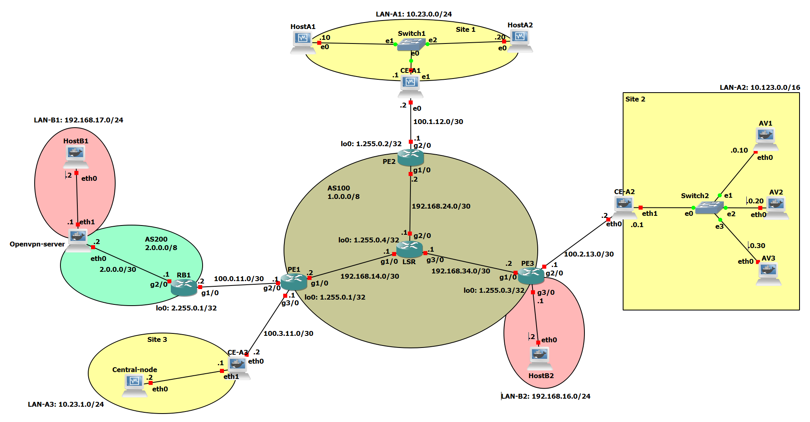

# Progetto-NSD
### Progetto per il corso di Network and System Defence dell'Università di Roma Tor Vergata
__Autori__
* :man_technologist: Adrian Baba (matricola 0320578)
* :woman_technologist: Sara Da Canal (matricola 0316044)
* :man_technologist: Matteo Fanfarillo (matricola 0316179)

## Table of contents

1. [AS100](#as100)
    1. [Configurazione dei router](#configurazione-dei-router)
        1. [LSR](#lsr)
        2. [PE](#pe)

2. [LAN-A1](#lan-a1)
    1. [CE-A1](#ce-a1)
3. [LAN-A2](#lan-a2)
   1. [CE-A2](#ce-a2)
   2. [AV](#av)
4. [LAN-A3](#lan-a3) 
    1. [CE-A3](#ce-a3)
    2. [Central-node](#central-node)
        1. [Sito web](#sito-web)
5. [AS200](#as200)
    1. [RB1](#rb1)
    2. [Configurazione di OpenVPN](#configurazione-di-openvpn)
        1. [Server](#server)
        2. [Client](#client)
        3. [HostB1](#hostb1)


Lo scopo di questo progetto è simulare la seguente rete: 

Nella rete abbiamo due AS, con AS200 customer di AS100. L'AS100 connette i tre siti di vpnA. Il sito 1 è costituito da due Host e un Client Edge, che comunicano tra di loro tramite MacSec. Il Client Edge presenta un firewall. Il sito 2 presenta un Client Edge e tre host con diversi antivirus. Anche qui il Client Edge fa da firewall. Nel sito 3 troviamo nuovamente un Client Edge e un central node accessibile dall'esterno. Il central node accetta file, li invia al sito 2 per l'analisi e mostra i risultati ottenuti. Per quanto riguarda AS200, si occupa di connettere il lato server di LanB, mentre il client è connesso ad AS100. Questi due siti sono connessi tra di loro tramite openvpn.

## AS100
### Configurazione dei router
I router implementano BGP come protocollo per la comunicazione con il resto della rete, OSPF per la comunicazione interna, MPLS con LDP che fornisce la base per l'instradamento tra diversi siti della VPN.
Abbiamo due tipi di router, LSR, nella parte centrale dell'AS, e Provider Edges. 
#### LSR
La configurazione dell'LSR è la seguente:   
*[SetupLSR.cfg](./scripts/routers/lsr/SetupLSR.cfg "SetupLSR.cfg")*
* Interfaccia di loopback usata per identificare il router:
    ```
    interface Loopback0                     
    ip address 1.255.0.4 255.255.255.255
    ```
* 3 interfacce verso i router PE (riportiamo solo la configurazione verso PE1), con l'attivazione del protocollo MPLS:
    ```
    interface GigabitEthernet1/0
    mpls ip     
    ip address 192.168.14.1 255.255.255.252
    no shutdown
    ```
* Configurazione di OSPF impostando i tre PE come neighbours:
    ```
    router ospf 1
    router-id 1.255.0.4
    network 1.255.0.4 0.0.0.0 area 0
    network 192.168.14.0 0.0.0.3 area 0
    network 192.168.24.0 0.0.0.3 area 0
    network 192.168.34.0 0.0.0.3 area 0
    ```
* Attivazione di LDP per automatizzare l'assegnazione delle label MPLS:
    ```
    mpls ldp autoconfig
    ```
* Route per scartare pacchetti con IP pubblico e sorgente l'AS stesso
    ```
    ip route 1.0.0.0 255.0.0.0 Null0
    ```
#### PE
I tre router PE hanno configurazioni molto simili tra loro, quindi ne verrà analizzata soltanto una (PE2):  
*[SetupPE1.cfg](./scripts/routers/provider-edges/SetupPE1.cfg "SetupPE1.cfg")*  
*[SetupPE2.cfg](./scripts/routers/provider-edges/SetupPE1.cfg "SetupPE2.cfg")*  
*[SetupPE3.cfg](./scripts/routers/provider-edges/SetupPE1.cfg "SetupPE3.cfg")*  
* Interfaccia di loopback per identificare il router:
    ```
    interface Loopback0                     
    ip address 1.255.0.2 255.255.255.255
    ```
* Setup della vpn con rd 100:0. La vpn ha una topologia con un hub e due spoke, il PE collegato all'hub ha route-target 100:1 e quelli collegati agli spoke route-target 100:2. PE3 è collegato al nostro hub, mentre PE1 e PE2 sono collegati agli spoke:
    ```
    ip vrf vpnA
    rd 100:0
    route-target import 100:1
    route-target export 100:2
    ```
* Interfaccia verso l'AS, con MPLS abilitato:
    ```
    interface GigabitEthernet1/0
    mpls ip            
    ip address 192.168.24.2 255.255.255.252
    no shutdown
    ```
* Interfaccia verso il Client Edge, con il forwarding verso la vpn:
    ```
    interface GigabitEthernet2/0
    ip vrf forwarding vpnA
    ip address 100.1.12.1 255.255.255.252
    no shutdown
    ```
* Configurazione di OSPF:
    ```
    router ospf 1
    router-id 1.255.0.2
    network 1.255.0.2 0.0.0.0 area 0
    network 192.168.24.0 0.0.0.3 area 0
    ```
* Attivazione di LDP per automatizzare l'assegnazione delle label MPLS:
    ```
    mpls ldp autoconfig
    ```
* Configurazione di BGP:
    ```
    router bgp 100
    network 1.0.0.0
    neighbor 1.255.0.1 remote-as 100
    neighbor 1.255.0.1 update-source Loopback0
    neighbor 1.255.0.1 next-hop-self
    neighbor 1.255.0.3 remote-as 100
    neighbor 1.255.0.3 update-source Loopback0
    neighbor 1.255.0.3 next-hop-self
    address-family vpnv4
    neighbor 1.255.0.1 activate
    neighbor 1.255.0.1 send-community extended
    neighbor 1.255.0.1 next-hop-self
    neighbor 1.255.0.3 activate
    neighbor 1.255.0.3 send-community extended
    neighbor 1.255.0.3 next-hop-self
    exit-address-family
    ```
* Configurazione della sottorete appartenente alla vpn:
   ```
    address-family ipv4 vrf vpnA
    network 10.23.0.0 mask 255.255.255.0
    exit-address-family
    ```
* Route per inviare i pacchetti della sottorete verso l'AS:
    ```
    ip route vrf vpnA 10.23.0.0 255.255.255.0 100.1.12.2
    ```
* Route per scartare pacchetti con IP pubblico e sorgente l'AS stesso
    ```
    ip route 1.0.0.0 255.0.0.0 Null0
    ```
 PE3 è l'unico provider edge che presenta delle particolarità, in particolare: 
 * Nell'interfaccia che si interfaccia verso la LanB e il client OpenVPN è stato attivato il natting:
 ```
    interface GigabitEthernet3/0
    ip address 192.168.16.1 255.255.255.0
    ip nat inside
    no shutdown
```
* Ci siamo assicurati che i collegamenti delle altre interfacce non subissero effetti dal nat (il seguente comando è stato aggiunto a tutte le altre interfacce):
```
ip nat outside
```
* Abbiamo permesso l'ingresso nell'interfaccia con il nat solo dei pacchetti provenienti dalla vpn:
```
    access-list 101 permit ip 192.168.16.0 0.0.0.255 any
    ip nat inside source list 101 interface Loopback0 overload
```
In più, dato che PE3 è il router collegato all'hub, deve mandare tutti i pacchetti della vpn verso il proprio CE:
```
ip route vrf vpnA 10.0.0.0 255.0.0.0 100.2.13.2

```

    
### LAN-A1
In questa sottorete abbiamo due host con configurazioni molto simili che devono stabilire una connessione MacSec e un Client Edge con tre funzioni: deve connettersi all'AS, partecipare a una connessione MacSec con gli altri host della sua sottorete e fornire un firewall tra la LAN-A1 e l'esterno. 
#### CE-A1
Configurazione per connettersi all'AS:  
*[SetupCE-A1.sh](./scripts/client-edges/SetupCE-A1.sh "SetupCE-A1.sh")*
* Abilitazione del forwarding:
    ```
    sysctl -w net.ipv4.ip_forward=1
    echo 1 > /proc/sys/net/ipv4/ip_forward
    ```
* Interfaccia verso l'AS:
    ```
    ip link set enp0s3 up
    ip addr add 100.1.12.2/30 dev enp0s3
    ```
* Route di default verso il proprio PE:
    ```
    ip route add default via 100.1.12.1
    ```
Configurazione del firewall:  
*[FirewallCE-A1.sh](./scripts/client-edges/FirewallCE-A1.sh "FirewallCE-A1.sh")*
* Flush di eventuali configurazioni precedenti:
    ```
    iptables -F
    iptables -F -t nat
    ```
* Drop di tutti i pacchetti verso il router o dall'esterno verso la sottorete:
    ```
    iptables -P FORWARD DROP
    iptables -P INPUT DROP
    ```
* Accept di tutti i pacchetti dal router o dalla sottorete verso l'esterno:
    ```
    iptables -P OUTPUT ACCEPT
    iptables -A FORWARD -i $LAN -o $AS -j ACCEPT
    ```
* Natting degli indirizzi per i pacchetti in uscita dalla sottorete:
    ```
    iptables -t nat -A POSTROUTING -o $AS -j MASQUERADE
    ```
* Permette il traffico ICMP o ssh in ingresso al router se proveniente dalla LAN:
    ```
    iptables -A INPUT -i $LAN -p tcp --dport 22 -j ACCEPT
    iptables -A INPUT -i $LAN -p icmp -j ACCEPT
    ```
* Permette il traffico in ingresso al router o alla LAN se proveniente da connessioni già stabilite:
    ```
    iptables -A INPUT -m state --state ESTABLISHED -j ACCEPT
    iptables -A FORWARD -m state --state ESTABLISHED -j ACCEPT
    ```
* Permette il traffico http dall'esterno verso la LAN con port forwarding:
    ```
        iptables -A INPUT -i $AS -p tcp --dport 80 -j ACCEPT
        iptables -A INPUT -i $AS -p tcp --dport 8080 -j ACCEPT
        iptables -A FORWARD -i $AS -o $LAN -p tcp --dport 80 -j ACCEPT
        iptables -A FORWARD -i $AS -o $LAN -p tcp --dport 8080 -j ACCEPT
        iptables -t nat -A PREROUTING -i $AS -p tcp --dport 80 -j DNAT --to-destination 10.23.0.10 
        iptables -t nat -A PREROUTING -i $AS -p tcp --dport 8080 -j DNAT --to-destination 10.23.0.20
    ```
 La configurazione MacSec è molto simile per CE-A1 e i due host, quindi verrà presentata solo quella del CE:  
*[MacsecCE-A1.sh](./scripts/client-edges/MacsecCE-A1.sh "MacsecCE-A1.sh")*   
*[MacsecHostA1.sh](./scripts/hosts/lan-A/MacsecHostA1.sh "MacsecHostA1.sh")*   
*[MacsecHostA2.sh](./scripts/hosts/lan-B/MacsecHostA2.sh "MacsecHostA2.sh")*   
* Inizializzare le due chiavi usate:
     ```
        export MKA_CAK=00112233445566778899aabbccddeeff
        export MKA_CKN=00112233445566778899aabbccddeeff00112233445566778899aabbccddeeff
    ```
* Eliminare di eventuali connessioni precedenti ancora attive:
     ```
     nmcli connection del macsec-123
    ```
* Aggiunta di una nuova connessione macsec:
     ```
        nmcli connection add type macsec \
    ```
* Assegnare i nomi alla connessione e all'interfaccia:
     ```
    con-name macsec-123 \
    ifname macsec0 \
    ```
* Abilitare la connessione automatica se le risorse sono disponibili:
     ```
    connection.autoconnect yes \
    ```
* Assegnare l'interfaccia fisica su cui la connessione macsec si appoggia:
     ```
        macsec.parent enp0s8 \
    ```
* Creare una connessione in modo preshared key e impostare le chiavi:
     ```
        macsec.mode psk \
        macsec.mka-cak $MKA_CAK \
        macsec.mka-cak-flags 0 \
        macsec.mka-ckn $MKA_CKN \
    ```
* Passare all'assegnazione manuale degli ip e assegnare un ip all'interfaccia:
     ```
        ipv4.method manual \
        ipv4.addresses 10.23.0.1/24
    ```
* Attivare la connessione:
     ```
        nmcli connection up macsec-123
    ```
 
 ### LAN-A2
 In questa sottorete abbiamo un Client Edge e tre host contenenti tre antivirus. Quando questa sottorete riceve dei file, gli antivirus devono attivarsi per analizzarli e fornire un report. Il CE deve anche fornire un firewall per evitare che i virus analizzati possano infettare altre componenti della rete.
 #### CE-A2
 La connessione all'AS di CE-A2 è molto simili a quella di CE-A1 quindi non verrà presentata, può essere trovata sul file *[SetupCE-A2.sh](./scripts/client-edges/SetupCE-A2.sh "SetupCE-A2.sh")*  
 Configurazione del firewall:  
 *[FirewallCE-A2.sh](./scripts/client-edges/FirewallCE-A2.sh "FirewallCE-A2.sh")*
 * Flush della configurazione precedente:
     ```
    iptables -F
    iptables -F -t nat
    ```
 * Drop di tutto il traffico in ingresso e uscita dalla rete o dal router:
     ```
        iptables -P FORWARD DROP
        iptables -P INPUT DROP
        iptables -P OUTPUT DROP
    ```
 * Permettere il traffico bidirezionale tra AVs e central node situato in LAN-A3:
     ```
    iptables -A FORWARD -s 10.23.1.0/24 -d 10.123.0.0/16 -j ACCEPT
    iptables -A FORWARD -s 10.123.0.0/16 -d 10.23.1.0/24 -j ACCEPT
    ```
 * Permettere tutto il traffico ICMP:
 ```
 iptables -A INPUT -p icmp -j ACCEPT
 iptables -A FORWARD -p icmp -j ACCEPT
 iptables -A OUTPUT -p icmp -j ACCEPT
 ```
 * Permettere il traffico di CE-A1 e CE-A3, che passa attraverso questo router dato che è un hub in vpnA:
    ```
    iptables -A FORWARD -s 10.23.1.0/24 -d 10.23.0.0/24 -j ACCEPT
    iptables -A FORWARD -s 10.23.0.0/24 -d 10.23.1.0/24 -j ACCEPT
    ```
 #### AV
I tre AV sono container docker su cui sono stati installati tre antivirus diversi. Oltre l'installazione, hanno il setup delle interfacce e gli script da eseguire per restare in ascolto in attesa di file da analizzare, analizzarli e inviare indietro i report.
##### Installazione degli antivirus:
Gli script per l'installazione sono i seguenti: [InstallAV1.sh](./scripts/hosts/lan-A/AV-installation/InstallAV1.sh "InstallAV1.sh"), [InstallAV2.sh](./scripts/hosts/lan-A/AV-installation/InstallAV2.sh "InstallAV2.sh") e [InstallAV3.sh](./scripts/hosts/lan-A/AV-installation/InstallAV3.sh "InstallAV3.sh").
##### Configurazione delle interfacce:
La configurazione delle interfacce di rete non ha particolarità, quindi non verrà presentata. Può essere trovata nei seguenti file:  
*[SetupAV1.sh](./scripts/hosts/lan-A/SetupAV1.sh "SetupAV1.sh")*   
*[SetupAV2.sh](./scripts/hosts/lan-A/SetupAV2.sh "SetupAV2.sh")*   
*[SetupAV3.sh](./scripts/hosts/lan-A/SetupAV3.sh "SetupAV3.sh")*   
##### Ricezione e analisi del binario:
Tranne che per l'effettivo comando di analisi, specifico per i diversi antivirus, anche questi file sono simili tra i tre AV. Sarà presentato il file di AV1.
*[ReceiveAndAnalyzeAV1.sh](./scripts/hosts/lan-A/ReceiveAndAnalyzeAV1.sh "ReceiveAndAnalizeAV1.sh")*  
*[ReceiveAndAnalyzeAV2.sh](./scripts/hosts/lan-A/ReceiveAndAnalyzeAV2.sh "ReceiveAndAnalizeAV2.sh")*   
*[ReceiveAndAnalyzeAV3.sh](./scripts/hosts/lan-A/ReceiveAndAnalyzeAV3.sh "ReceiveAndAnalizeAV3.sh")* 

* Aprire la connessione netcat per la ricezione del binario, redirezionando l'output su un file, e attendere che l'invio sia terminato:
```
    nc -lnvp 50000 > binary &
    wait
```
* Rendere eseguibile il file ottenuto e provare ad eseguirlo:
```
    chmod +x binary
    ./binary &
```
* Attendere per consentire la fine dell'esecuzione:
```
    sleep 10
```
* Eseguire la scansione, i tre diversi comandi riportati sono usati da ciascuno degli antivirus, e creare i file di log:
```
    clamscan -i --exclude-dir="^/sys" -r / > log1.log

    rkhunter -c --rwo --sk --summary > log2.log

    chkrootkit -q > log3.log
```
* Inviare i file di log al central node:
```
    nc -q 10 10.23.1.2 50001 < log1.log
```

## LAN-A3
Questa LAN è costituita dal CE e dal central node. Il central node è accessibile dalla rete esterna, ed espone un sito web tramite il quale è possibile caricare file. Ogni volta che riceve un file, questo viene inviato verso gli AV. Il central-node aspetta una risposta e la mostra all'utente connesso.

### CE-A3
La connessione all'AS di CE-A3 è molto simili a quella di CE-A1 quindi non verrà presentata, può essere trovata sul file *[SetupCE-A3.sh](./scripts/client-edges/SetupCE-A3.sh "SetupCE-A3.sh")*  
 
 ### Central-node
 Abilitare la connessione della macchina verso l'esterno:
 * Per farla accedere ad internet: VirtualBox -> selezionare la macchina -> impostazioni -> rete -> scegliere la scheda di rete da usare -> abilitarla e impostarla a NAT
 * Per renderla accessibile tramite l'ip dell'host sulla porta 8080: Avanzate -> Inoltro delle porte -> add -> protocollo TCP / porta host 8080 / porta guest 80
Setup delle interfacce e listening per le comunicazioni dagli AV:
*[SetupCentralNode.sh](./scripts/hosts/lan-A/SetupCentralNode.sh "SetupCentralNode.sh")* 
* Setup dell'interfaccia:
```
ip link set enp0s3 up
ip addr add 10.23.1.2/24 dev enp0s3
```
* Aggiunta delle route verso il resto della lan (non possiamo mettere default verso la lan come per gli altri host dato che il default è verso la rete esterna):
```
ip route add 10.23.0.0/24 via 10.23.1.1
ip route add 10.123.0.0/16 via 10.23.1.1
```

##### Sito web:
Per rendere disponibile l'interfaccia web abbiamo usato Apache. Dopo aver installato il necessario nella macchina virtuale, tutto il materiale relativo al sito è situato nella directory /var/www/html.
* Pagina principale:    
 *[index.html](./scripts/hosts/lan-A/Sito-web/index.html "index.html")*   
Questa pagina serve a mostrare un form che permette di scegliere un file locale e fare l'upload di quel file per avviarne l'analisi. 
* Funzione di upload:    
*[upload.php](./scripts/hosts/lan-A/Sito-web/upload.php "upload.php")*   
La funzione di upload copia il file sulla VM, poi chiama lo script per l'invio del file verso gli AV e carica la pagina che mostra il report.
* Script per l'invio di file:    
*[SendToAV.sh](./scripts/hosts/lan-A/Sito-web/SendToAV.sh "SendToAV.sh")*   
Questo script si occupa di inviare il file ricevuto in upload ai tre AV, dopo aver aperto le porte per la ricezione delle risposte. Quando riceve i file di log, li elabora generando un unico report.
* Pagina del report:    
*[report.html](./scripts/hosts/lan-A/Sito-web/report.html "report.html")*  
Questa pagina mostra il report ottenuto dagli AV.

 ## AS200
 Questo AS è un customer di AS100, ed è costituito da un solo router, RB1, che comunica tramite eBGP con PE1. Collegata a questo AS troviamo la LAN-B, una Virtual LAN creata con OpenVPN. Il server OpenVPN è collegato a RB1, e fa da gateway della LAN dietro di lui, mentre il client OpenVPN è collegato a PE3.
 ### RB1
 La configurazione di RB1 è la seguente:
 *[SetupRB1.cfg](./scripts/routers/rb1/SetupRB1.cfg "SetupRB1.cfg")*
 * Interfaccia di loopback:
     ```
     interface Loopback0
    ip address 2.255.0.1 255.255.255.255
     ```
 * Configurare le due interfacce di rete del router, una verso PE1 e una verso il server OpenVPN:
      ```
        interface GigabitEthernet1/0
        ip address 100.0.11.2 255.255.255.252
        no shutdown
       
        interface GigabitEthernet2/0
        ip address 2.0.0.1 255.255.255.252
        no shutdown
     ```
 * Configurare eBGP con PE1 come unico neighbor:
      ```
        router bgp 200
        network 2.0.0.0
        neighbor 100.0.11.1 remote-as 100
     ```
 * Inserire un'ip route per scartare i pacchetti provenienti dall'AS stesso:
     ```
    ip route 2.0.0.0 255.0.0.0 Null0
     ```
### Configurazione di OpenVPN
Abbiamo tre componenti: il server openVPN, HostB1 (direttamente connesso al server ma non un client della VPN) e HostB2 (client della VPN). Prima di iniziare la configurazione abbiamo usato le funzioni di easy-rsa per generare le chiavi e i certificati necessari al funzionamento della vpn.
#### Server
La configurazione del server è divisa in tre:
* Configurazione delle interfacce (*[SetupOpenvpn-server.sh](./scripts/hosts/lan-B/SetupOpenvpn-server.sh "SetupOpenvpn-server.sh")*):
  1. Impostare le due interfacce:  
     ```
       ip link set eth0 up
        ip link set eth1 up
        ip addr add 2.0.0.2/30 dev eth0
        ip addr add 192.168.17.1/24 dev eth1
     ```
  2. Aggiungere route di default verso RB1:
     ```
        ip route add default via 2.0.0.1
     ```
  3. Abilitare il forwarding:
     ```
        echo 1 > /proc/sys/net/ipv4/ip_forward
     ```
* Configurazione della vpn (*[server.ovpn](./scripts/conf/server.ovpn "server.ovpn")*):
    1. Creare l'interfaccia tunnel per la vpn, stabilire la porta e il protocollo per la comunicazione:
     ```
        port 1194
        proto udp
        dev tun
     ```
    2. Indicare i file di chiavi e certificati:
    ```
        ca ca.crt
        cert nsd-server.crt
        key nsd-server.key
        dh dh.pem
     ```
    3. Associare una rete all'interfaccia tunnel del server:
    ```
        server 192.168.100.0 255.255.255.0
     ```
    4. Impostare la route da inviare al client:
    ```
     push "route 192.168.17.0 255.255.255.0"
     ```
    6. Impostare al server la route verso il client. Questo funziona insieme all'impostazione di una iroute, che si trova sul file client01 all'interno della directory ccd:
     ```
        route 192.168.16.0 255.255.255.0
        
        iroute 192.168.16.0 255.255.255.0
     ```    
    7. Impostare la directory ccd come directory per la configurazione del client:
     ```
        client-config-dir ccd
     ```    
    5. Impostare la frequenza del keepalive:
    ```
        keepalive 10 120
     ```    
    6. Impostare il tipo di cifratura:
    ```
        cipher AES-256-CBC
     ```        
* Configurazione del nat (*[NattingOpenvpn-server.sh](./scripts/hosts/lan-B/NattingOpenvpn-server.sh "NattingOpenvpn-server.sh")*):
    1. Mascherare gli indirizzi della vpn nei messaggi inviati verso HostB1:
    ```
        iptables -t nat -A POSTROUTING -s 192.168.100.0/24 -o eth1 -j MASQUERADE
     ```      

     
#### Client
* Configurazione delle interfacce, non presentata dato che le interfacce degli host sono molto semplici (*[SetupHostB2.sh](./scripts/hosts/lan-B/SetupHostB2.sh "SetupHostB2.sh")*)
* Configurazione della vpn (*[client01.ovpn](./scripts/conf/client01.ovpn "client01.ovpn")*):
    1. Impostare il protocollo e l'interfaccia da usare:
    ```
        dev tun
        proto udp
     ```        
    2. Dichiarare l'ip e la porta del server e far si che siano possibili infiniti tentativi di connessione:
     ```
        remote 2.0.0.2 1194
        resolv-retry infinite
     ```       
    3. Impostare i file di chiavi e certificati e verificare il certificato del server:
    ```
        ca ca.crt
        cert client01.crt
        key client01.key
        remote-cert-tls server
     ```        
    4. Impostare il tipo di cifratura:
    ```
        cipher AES-256-CBC
     ```  
#### HostB1
Per il funzionamento è necessario soltanto configurare le interfacce, la configurazione può essere trovata nel file [SetupHostB1.sh](./scripts/hosts/lan-B/SetupHostB1.sh "SetupHostB1.sh") 
